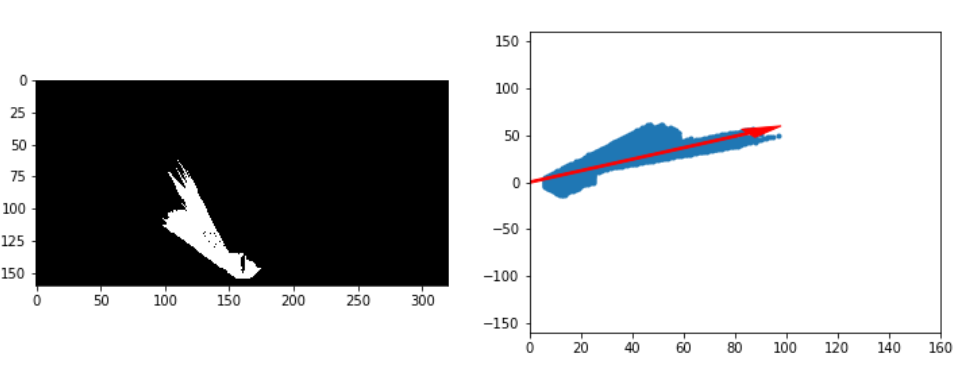

# *RoboND_Search_and_Sample_Return*

This project covers the implementation of all three essential elements of robotics: **Perception, Decision Making, and Actuation** for a **Mars Rover**'s autonomous navigation, mapping, collecting sample rocks and return to the original start point in a simulated environment.

**Unity** are used for simulating the environment in this project and **Jupyter Notebook with Python** is choosed to write most of the code.

This is a `README` that includes all the key points and how I addressed each one.

**Steps to complete the project:**  

1. Download the simulator appropriate for your OS ([MacOS](https://s3-us-west-1.amazonaws.com/udacity-robotics/Rover+Unity+Sims/Mac_Roversim.zip), [Linux](https://s3-us-west-1.amazonaws.com/udacity-robotics/Rover+Unity+Sims/Linux_Roversim.zip), [Windows](https://s3-us-west-1.amazonaws.com/udacity-robotics/Rover+Unity+Sims/Windows_Roversim.zip)).
2. Get setup with Python using the [Python Starter Kit](https://github.com/udacity/RoboND-Python-StarterKit/blob/master/doc/configure_via_anaconda.md).
3. Fork, download or clone the [project repository](https://github.com/udacity/RoboND-Rover-Project) and have a look at the `README`.
4. Experiment with the simulator and take some data ( explained in the Telemetry and Record Data lesson).
5. Run through the Jupyter notebook and fill in the `process_image()` function.
6. Run `drive_rover.py` and experiment with autonomous mapping (details in the More Decisions lesson).
7. Fill in the `perception_step()` and `decision_step()` functions and map the environment!

# 1 Notebook Analysis
## 1.1 Run the functions provided in the notebook on test images (first with the test data provided, next on data you have recorded). Add/modify functions to allow for color selection of obstacles and rock samples.

The first step is to do a perspective transformation as shown below:

After several experiments, *rgb_thresh=(160, 160, 160)* is selected to be a suitable threshold for selecting **navigable terrain**.

As for the **obstacles**, the equation is *obstacle = np.absolute(np.float32(navigable) - 1) * mask* where mask is the section of the image after perspective transformation as shown below:

As for the **rock**, since the rock appears yellow in the simulated environment, a *yellow_thresh = (110 < img[:,:,0]) & (img[:,:,0]< 220) & (110 < img[:,:,1]) & (img[:,:,1]< 220) & (0 < img[:,:,2]) & (img[:,:,2]< 50)* is used to filter out the rock samples.

The original input frame with its perspective transformation and results after the thresholding (navigable_terrain, obstacles and rock) are shown below (indicated by white pixels):

After getting the navigable terrain, the forward direction of the rover can be determined.

## 1.2 Populate the process_image() function with the appropriate analysis steps to map pixels identifying navigable terrain, obstacles and rock samples into a worldmap. Run process_image() on your test data using the moviepy functions provided to create video output of your result.

Coordinates rotation, translation and scaling are used to transform the rover-centric map into world map as shown below. Details are shown in `perception.py`.

As for the mapping out video, please refer to `test_mapping.mp4` .

# 2 Autonomous Navigation and Mapping
## 2.1 Fill in the perception_step() (at the bottom of the perception.py script) and decision_step() (in decision.py) functions in the autonomous mapping scripts and an explanation is provided in the writeup of how and why these functions were modified as they were.

