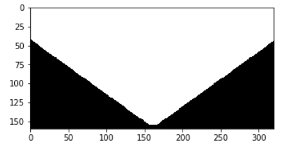

# *RoboND_Search_and_Sample_Return*

This project covers the implementation of all three essential elements of robotics: **Perception, Decision Making, and Actuation** for a **Mars Rover**'s autonomous navigation, mapping, collecting sample rocks and return to the original start point in a simulated environment.

**Unity** are used for simulating the environment in this project and **Jupyter Notebook with Python** is choosed to write most of the code.

This is a `README` that includes all the key points and how I addressed each one.

**Steps to complete the project:**  

1. Download the simulator appropriate for your OS ([MacOS](https://s3-us-west-1.amazonaws.com/udacity-robotics/Rover+Unity+Sims/Mac_Roversim.zip), [Linux](https://s3-us-west-1.amazonaws.com/udacity-robotics/Rover+Unity+Sims/Linux_Roversim.zip), [Windows](https://s3-us-west-1.amazonaws.com/udacity-robotics/Rover+Unity+Sims/Windows_Roversim.zip)).
2. Get setup with Python using the [Python Starter Kit](https://github.com/udacity/RoboND-Python-StarterKit/blob/master/doc/configure_via_anaconda.md).
3. Fork, download or clone the [project repository](https://github.com/udacity/RoboND-Rover-Project) and have a look at the `README`.
4. Experiment with the simulator and take some data ( explained in the Telemetry and Record Data lesson).
5. Run through the Jupyter notebook and fill in the `process_image()` function.
6. Run `drive_rover.py` and experiment with autonomous mapping (details in the More Decisions lesson).
7. Fill in the `perception_step()` and `decision_step()` functions and map the environment!

# 1 Notebook Analysis
## 1.1 Run the functions provided in the notebook on test images (first with the test data provided, next on data you have recorded). Add/modify functions to allow for color selection of obstacles and rock samples.

The first step is to do a perspective transformation as shown below:

After several experiments, *rgb_thresh=(160, 160, 160)* is selected to be a suitable threshold for selecting **navigable terrain**.

As for the **obstacles**, the equation is *obstacle = np.absolute(np.float32(navigable) - 1) * mask* where mask is the section of the image after perspective transformation as shown below:

As for the **rock**, since the rock appears yellow in the simulated environment, a *yellow_thresh = (110 < img[:,:,0]) & (img[:,:,0]< 220) & (110 < img[:,:,1]) & (img[:,:,1]< 220) & (0 < img[:,:,2]) & (img[:,:,2]< 50)* is used to filter out the rock samples.

The original input frame with its perspective transformation and results after the thresholding (navigable_terrain, obstacles and rock) are shown below (indicated by white pixels):

After getting the navigable terrain, the forward direction of the rover can be determined.

## 1.2 Populate the process_image() function with the appropriate analysis steps to map pixels identifying navigable terrain, obstacles and rock samples into a worldmap. Run process_image() on your test data using the moviepy functions provided to create video output of your result.

Coordinates rotation, translation and scaling are used to transform the rover-centric map into world map as shown below. Details are shown in `perception.py`.

As for the mapping out video, please refer to `test_mapping.mp4`. One sample frame of the output mapping video is shown below. The bule, red and yellow indicate navigable terrain, obstacles and rock accordingly.

# 2 Autonomous Navigation and Mapping
## 2.1 Fill in the perception_step() (at the bottom of the perception.py script) and decision_step() (in decision.py) functions in the autonomous mapping scripts and an explanation is provided in the writeup of how and why these functions were modified as they were.

### Two modifications are introduced in perception_step():
1. Optimizing Map Fidelity: Your perspective transform is technically only valid when roll and pitch angles are near zero. If you're slamming on the brakes or turning hard they can depart significantly from zero, and your transformed image will no longer be a valid map. Setting thresholds near zero in roll and pitch to determine which transformed images are valid for mapping. i.e. Adding one conditional statement : *if abs(Rover.pitch) < 1 and abs(Rover.roll) < 1:* To avoiding mapping when the rover is pitching or rolling heavily which can help to optimize map fidelity.
2. Optimizing for Finding All Rocks Tip: The rocks always appear near the walls. Think about making your rover a "wall crawler" that explores the environment by always keeping a wall on its left or right. If done correctly, this optimization can help all the aforementioned metrics. i.e. Adding *Rover.nav_angles += 0.3*. But to remember reduce this 0.3 in the `decision.py` when determining the rover's forward direction.

### As for decision_step():
1. A new rover state parameter called Rover.stuck is created. It is used to check whether the rover is stucking at somewhere or now. In order to achieve this, I compared the current position with the previous position every loop. Once the difference between these two is less than 0.01, the Rover.stuck increases 5. When Rover.stuck is greater than 100, the Rover.mode will be set to 'stuck' and the rover will automatically steer itself to get away from stucking at somewhere.
2. Besides "Stuck", 3 new modes "Rock", "Picking up" and "parked" are added. "rock" and "PickingUp" can give the rover the ability to picking up rock samples. As long as the rover has a see on a nearby rock sample, the Rover.mode will change from "forward" to "rock" in which the speed of the rover will decrease and the direction will be set to the rock orientation. As long as the rover loses the track of rock during this process, the mode will be changed back to "forward" and the car continue to nagivate itself autonomously. When the rover is close enough to the rock, the Rover.mode will change from "rock" to PickUp where the brake will be fully turned on and picking up rock sample process will be activated. As for the "parked" mode, when the car mapped over 97% of the map or collected all 6 rock samples and return back to its initial start point, its jobs are done and it will park there.
#### For more code details, please refer to `perception.py` and `decision.py`.

## 2.2 Launching in autonomous mode your rover can navigate and map autonomously. Explain your results and how you might improve them in your writeup.

Simulator was running with the following settings and FPS:

Parameter | Value
--- | --- 
Screen resolution | 1280 * 960
Graphics quality | Fastest
FPS	 | 25-30

The result is relatively satifing and stable. Average performance for each run are shown below:
Metric | Average value
--- | --- 
Mapped |	70-80
Fidelity |	65-70
Located |	4-6
Collected |	3-6
Time | 1000 s
